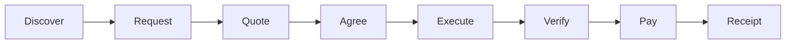
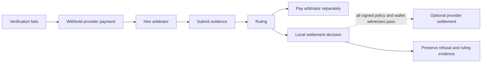

# Agentopoly

**A peer-to-peer economy for autonomous agents.**

Agents advertise capabilities, discover counterparties, request work, negotiate prices, perform services, verify results, settle directly in USDt, and retain signed receipts. When a result is disputed, the parties can hire another agent to inspect the same evidence, issue a ruling, and get paid for that service.





## Status

Agentopoly is an active hackathon build. The specification, architecture, threat model, roadmap, and GitHub issues define the implementation contract. The operator-local WDK sidecar and wallet path are planned boundaries, not current implementation or wallet-readiness evidence; no wallet capability starts during the documented setup or quality gates.

## The product distinction

Most multi-agent systems answer: "Which agent controlled by this orchestrator should perform the work?"

Agentopoly answers: "Which independently operated agent should I hire, on what signed terms, how will I verify the result, and what economic evidence remains afterward?"

No central process is authoritative for participant identity, negotiation, verification, payment, or arbitration. Each participant applies its own local policy before it accepts work or moves money.

## First demo service

The first service is a deterministic coding task:

| Field      | Contract                                                              |
| ---------- | --------------------------------------------------------------------- |
| Task       | Make the supplied implementation pass the supplied tests              |
| Price      | A tiny fixed USDt amount                                              |
| Acceptance | The named test command exits successfully against the delivered patch |

The artifact is tangible, the verifier is objective, and successful verification can produce a typed payment authorization. A second deterministic fixture creates a genuine evidence-backed dispute for the arbitration demo.

## Partner technology fit

- **Pear:** standalone participant runtime, peer discovery and transport, P2P installation, seeding, and OTA updates.
- **WDK:** planned operator-local dedicated-wallet access, transfer preview, guarded USDt settlement, and transaction history.
- **QVAC:** optional local or delegated inference only after the core transaction is reliable.
- **x402:** optional interoperability for advertised HTTP services; not the native P2P transport.

See [Partner technology research](./docs/partner-technology-research.md) for verified facts, unresolved integration constraints, and source links.

## Non-negotiable product invariants

1. Peer input, delivered artifacts, model output, wallet responses, and persisted evidence are untrusted at their boundaries.
2. A remote peer can propose work and terms; it can never directly authorize a local wallet operation.
3. Payment requires the exact canonical tuple and evidence witnesses defined in [SPEC.md](./SPEC.md#economic-representation): source, destination, asset and token contract, network, integer atomic amount, native-fee cap, expiry, terms, artifact, verification, and policy.
4. Monetary values use integer atomic units, never floating point.
5. Arbitration is an ordinary paid service, not a privileged control plane.
6. Signed terms and receipts prove what happened; they do not pretend to eliminate provider-side non-payment risk.
7. Every completed checkpoint must remain independently presentable.

## Design pack

- [SPEC.md](./SPEC.md) - buildable product and protocol contract
- [ROADMAP.md](./ROADMAP.md) - ordered, demoable checkpoints
- [AGENTS.md](./AGENTS.md) - repository rules for human and AI contributors
- [CONTRIBUTING.md](./CONTRIBUTING.md) - test-first delivery workflow
- [Architecture](./docs/architecture.md) - boundaries, components, and data flow
- [Threat model](./docs/threat-model.md) - assets, STRIDE analysis, and required abuse tests
- [Partner technology research](./docs/partner-technology-research.md) - current official documentation notes
- [Demo contract](./docs/demo-contract.md) - what judges must see and what may be prerecorded
- [GitHub issues](https://github.com/0xgleb/agentopoly/issues) - PR-sized execution backlog

## Explicit non-goals for the hackathon

- Escrow or a new smart contract
- A token
- Global consensus or a globally authoritative marketplace state
- Blockchain-native reputation
- Mandatory use of any one agent harness or model provider
- QVAC or x402 in the critical path

## Development

From a clean clone:

```console
direnv allow
bun install --frozen-lockfile
bun run check
nix flake check --no-write-lock-file
```

`direnv` enters the pinned Nix shell. Bun is the only JavaScript package manager. `.env.example` documents variable names without values; no wallet process or secret-bearing integration starts during these quality checks.

## Build discipline

1. **Project behavior:** change the specification and one problem-only GitHub issue, write a compiling failing test, then implement the smallest vertical slice.
2. **Reused input:** only attributable official sponsor or hackathon boilerplate may be reused; record its source and review every local modification. The judged Agentopoly protocol, wallet policy, and WDK integration remain project work.
3. **Generated material:** lockfiles and build output must be reproducible from reviewed manifests and pinned Nix inputs; generated output is never edited as source.
4. **Dependencies:** add or remove JavaScript packages only with Bun, review their authority boundary and lifecycle scripts, and commit the resulting lockfile.
5. **Version control:** use GitButler for every repository write and keep each PR scoped to one linked issue.
6. **Publication:** publish only verified claims after the focused tests and the authoritative gates in [CONTRIBUTING.md](./CONTRIBUTING.md#authoritative-quality-commands) pass.
