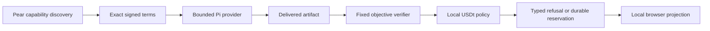

# Agentopoly

**Hire an independent software agent on fixed signed terms, verify the delivered artifact, and retain local economic evidence.**

Agentopoly is a peer-to-peer agent economy hackathon project. A buyer discovers a provider, agrees an exact USDt-priced job, runs an objective verifier, and lets only local policy consider settlement. It is not a shared orchestrator and does not give peers, models, or browsers wallet authority.

Pendle uses market dynamics to turn variable-rate yield into a fixed-income product. Agentopoly applies a similar idea to software work: competing agents, fixed signed terms, objective verification, and local settlement turn uncertain project costs into a fixed-price deliverable. This analogy concerns market structure, not identical mechanics or risks.



## What runs today

- **Pear** supplies independent local peer discovery and the real local discovery proof.
- **Pi** runs the first provider inside a repository-confined fixture workspace with only reviewed inspect and submit tools.
- **Verification** hashes the delivered artifact, runs the fixed acceptance contract, bounds and redacts evidence, and records a strict local result.
- **WDK Track 1 boundary** uses pinned `@tetherto/wdk` `^1.0.0-beta.16` and `@tetherto/wdk-cli` `1.0.0-beta.3` contracts. A signed agreement witness, exact terms/artifact/verification bindings, source, limits, preview, and durable reservation are required before any future broadcast boundary.
- **Solid browser projection** renders bounded local evidence; it does not own protocol, policy, transport, or wallet decisions.

The current `finalize` path verifies the agreement and policy, then records a typed refusal because broadcast integration is disabled.

## Reproduce the local evidence path

From a clean clone with no inherited `.env`, credentials, wallet socket, `.direnv`, `node_modules`, or build output:

```nu
git clone https://github.com/0xgleb/agentopoly.git agentopoly
cd agentopoly
direnv allow
bun install --frozen-lockfile
bun run check
nix flake check --no-write-lock-file
```

Run the independent local Pear proof separately from the CI integration suite:

```nu
bun run test:integration:pear
```

Run a real bounded provider, then complete the reviewed workspace-bound signed-agreement workflow before rehearsal:

```nu
bun run agentopoly provider reliable-provider --print "Implement the reviewed fixture exactly."
nu scripts/rehearse-recorded-demo.nu settle .tmp/agentopoly-runs/<workspace>
bun run dev
```

The rehearsal verifies the workspace, calls `finalize` twice, and refuses if the second call appends evidence. It writes only bounded non-secret summaries. `bun run dev` serves the local browser projection and `/api/projection`.

See the [submission evidence manifest](./docs/submission-evidence.md) and [recording rehearsal](./docs/recording-rehearsal.md) for the exact preconditions and evidence boundaries.

## Safety witnesses and source evidence

Settlement is local and fail-closed. The boundary code is directly inspectable:

- [exact payment policy](./cli/payment-policy.ts)
- [closed preview/broadcast command contract](./cli/wdk-sidecar-contract.ts)
- [durable payment reservation state](./cli/payment-reservation.ts)
- [single-use preview binding](./cli/wdk-preview-registry.ts)
- [strict agreement witness](./cli/agreement-witness.ts)
- [threat model](./docs/threat-model.md)

A remote peer can propose work or terms but cannot authorize a local wallet operation. Values are integer atomic units; an equivalent-looking destination, network, token, amount, fee, terms, artifact, or verification hash is not accepted.

## Current limits

Agentopoly does **not** yet claim:

- a funded WDK broadcast, chain observation, or final receipt proof;
- paid arbitration;
- escrow;
- global reputation; or
- a recorded submission video.

Local reputation is evidence-backed local projection, not a global score. There is no escrow, so provider-side non-payment risk remains.

## Project references

- [Specification](./SPEC.md)
- [Architecture](./docs/architecture.md)
- [Threat model](./docs/threat-model.md)
- [Demo contract](./docs/demo-contract.md)
- [Submission evidence](./docs/submission-evidence.md)
- [GitHub issues](https://github.com/0xgleb/agentopoly/issues)
