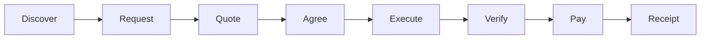
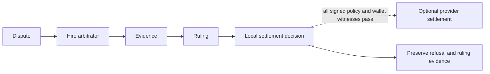
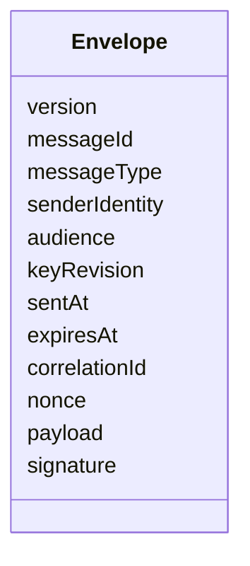
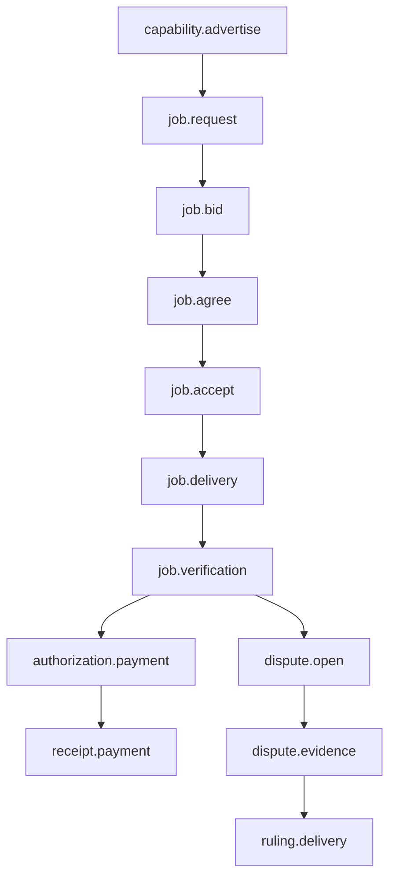
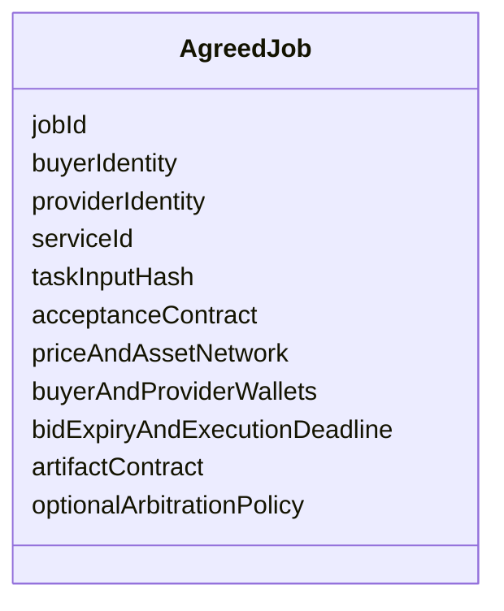
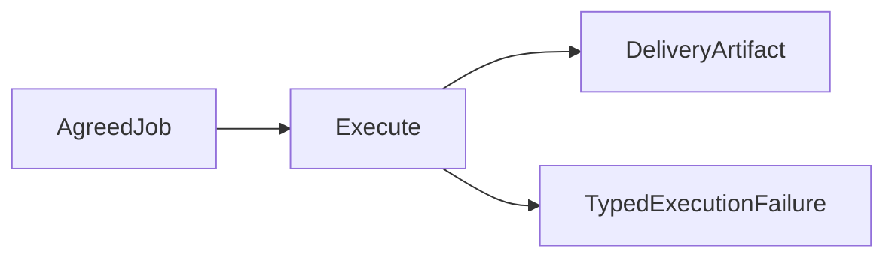
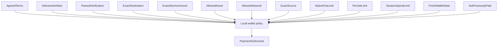
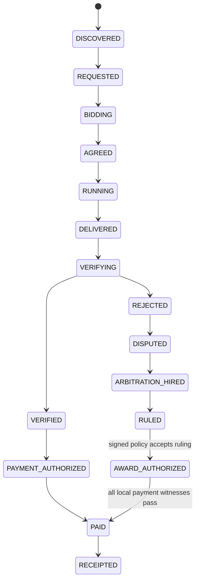

# Agentopoly specification

- Status: active hackathon specification
- Product target: hackathon MVP
- Primary presentation: polished local browser dashboard showing the live agent economy, with CLI/TUI fallback
- Settlement policy: capped automatic USDt after objective verification

This document specifies behavior. Sequencing belongs in [ROADMAP.md](./ROADMAP.md); implementation technique belongs in code and reviewed architecture notes.

## Goal

Agentopoly lets independently operated agents become economic counterparties. A participant can advertise a service, discover offers, negotiate signed terms, execute work, verify an artifact, settle payment, retain a receipt, and hire another participant to arbitrate a dispute.

## Roles

A participant may hold several roles, but each transaction names them explicitly:

- **Buyer:** requests work, chooses a bid, verifies delivery, and agrees to payment terms. A buyer peer message can never authorize or broadcast a local wallet operation; only the reviewed local policy may create `PaymentAuthorized`, and only the local wallet adapter may broadcast it.
- **Provider:** advertises a capability, quotes terms, executes work, and delivers an artifact.
- **Arbitrator:** sells evidence review and returns a signed ruling artifact.
- **Operator:** provisions local identity, dedicated wallet, and reviewed spending policy.

No role implies global authority. In capped automatic mode the operator is not an approval step for each payment; authorization comes from the previously reviewed local policy plus exact transaction witnesses.

## Identity

An identity binds a protocol signing key, transport peer key, wallet address, display name, and capability revision. These values can have different rotation rules and must not be treated as interchangeable.

Identity rotation, wallet replacement, and capability revision require signed statements and cannot rewrite old receipts.

## Economic representation

- Asset identifiers are a closed configured set.
- USDt amounts are unsigned integer atomic units plus explicit asset, network, and decimals definitions.
- Prices never use JavaScript `number` or floating-point arithmetic.
- A quote binds the canonical payment tuple: network identifier, asset identifier and token contract or mint, decimals definition, unsigned atomic amount, source wallet identity and account index, destination address, maximum native-fee atomic amount, expiry, and service terms.
- A payment authorization binds that exact tuple to the terms hash, artifact hash, verification hash, policy revision, and one authorization key. No caller may substitute an equivalent-looking network, asset, source, destination, amount, fee, or evidence record.

## Protocol envelope

Every wire message has a bounded envelope:

Protocol v1 accepts an encoded application frame of at most 65,536 bytes and inline verification evidence of at most 16,384 bytes. Identifiers, identity, audience, and signing-key revision fields are at most 256 UTF-8 bytes; every other individual string field is at most 1,024 UTF-8 bytes. Compressed frames are not valid in v1. Length and compression markers are checked before payload allocation or decoding. Larger artifacts and evidence use bounded, hash-linked storage references rather than inline frames.

Each participant allows at most 64 connected peers, 32 queued undecoded frames per peer, 128 queued undecoded frames globally, and 20 accepted frames per peer in any rolling 10-second window with a burst ceiling of 40. Ordinary messages expire within five minutes and tolerate at most 30 seconds of future clock skew; capability advertisements expire within fifteen minutes.

A reviewed schema decoder parses every untrusted wire value before domain logic runs. Library selection must pass the Bun and Bare compatibility proof, but decoding is mandatory rather than conditional on one library. Boundary parsing rejects unknown versions, missing fields, unknown message types, oversized payloads, invalid signatures, and out-of-domain values. Internal modules receive parsed domain values rather than raw objects.

After bounded schema and signature validation, admission checks the persisted message ID before expiry or nonce state. Identical canonical bytes for an accepted ID return its recorded result; different bytes under that ID are a conflict. Only an unseen ID proceeds to expiry checking and then nonce admission, so an unseen expired message is `expired` and an unseen non-expired nonce at or below the high-water mark is `replayed`.

Protocol v1 message families:

Protocol v1 uses one canonical byte encoding for both signatures and hashes. Issue #3 must prove that the same fixed envelope fixture produces identical bytes in Bun and Bare; object-key order or runtime-specific JSON serialization can never define signed bytes.

Replay admission is strict and durable per `(sender identity, signing-key revision)`. The first accepted nonce establishes a high-water mark. A later nonce is accepted only when it is greater than that mark; gaps are allowed, and a delayed nonce at or below the mark is rejected rather than reordered. A key revision starts a new sequence only after its signed rotation statement is accepted.

The participant atomically persists the new high-water mark, message ID, payload hash, and transition result before acknowledging the message or starting a side effect. Non-economic deduplication records remain for 30 days after message expiry. Records linked to agreements, execution, verification, payments, receipts, disputes, or rulings remain with that evidence.

Every persisted record and migration snapshot begins with an explicit schema version and is decoded and invariant-checked into a versioned persisted type before it can affect live state. A migration writes an immutable replacement generation, including every nonce high-water mark, message result, payload hash, key revision, agreement, evidence record, receipt, and settlement state. It validates that generation and its checksum before atomically selecting it through one durable generation manifest. Single-writer generation fencing rejects stale commits. An interruption leaves either the complete prior generation or the complete validated replacement authoritative; unselected snapshots have no authority.

Unsupported versions, missing migration paths, corrupt records, stale generation writers, or failed post-migration validation keep networking and side effects closed. Rollback may select an older generation only when its compatibility contract proves that no accepted state is lost. Issues #3 and #13 own the persisted-state contract and its interruption, stale-writer, corruption, and preservation tests before networking implementation is accepted.

## Capability market

A capability advertisement states the service, input and output contracts, price hint, wallet address, supported verification modes, revision, and expiry. Advertisements are hints, not binding offers. A buyer must request a specific job and accept a specific bid before terms exist.

Peers expire stale advertisements locally. There is no global marketplace database. A local participant may append a bounded typed `capability.observed` record to its shared live event log only after a signed peer advertisement passes protocol admission and capability-market admission. The record binds the provider identity, capability ID, price basis, limits, expiry, bounded evidence summary, and admitted envelope with `live-peer` provenance. The browser may project a capability only from that record. A claim, duplicate, withdrawal, malformed, expired, replayed, refused advertisement, partial record, forged provenance, or untrusted legacy field cannot create a capability card, verification result, reputation change, payment state, wallet, or other local authority. Capability discovery remains unobserved until at least one valid live-peer event is recorded.

## Job agreement

Signed terms bind:

A job becomes agreed only after both parties sign the same canonical terms hash. A signature over a different serialization, revision, or hash is not partial agreement.

## Execution

Provider execution is an adapter:

The first adapter operates only on a bounded repository-owned deterministic coding fixture. It runs in an isolated disposable workspace, receives no wallet capability, and cannot access unrelated operator files. Model output is data until validated and applied inside that workspace.

The required provider adapter is a packaged Agentopoly CLI built on Pi and the exact reviewed Oh My Pi package. It loads an Agentopoly project extension that removes general host mutation and wallet tools, exposes only fixture-scoped inspect and submit capabilities, and emits bounded typed job events for the browser dashboard. Provider identity labels and task prompts are bounded runtime inputs; production code contains no hard-coded reliable, malicious, or demo agents. The recorded demo injects distinct reliable-provider and malicious-or-incompetent prompts into separate real Pi sessions. Both perform real work in their own disposable fixture workspace; the second prompt produces an artifact that genuinely violates a named acceptance criterion. A buyer verifies the resulting artifacts through the local reviewed command contract before any payment decision.

Prompt profiles, recorded fixtures, and test projections are labeled by provenance. A test or simulation can prove the state contract but cannot be presented as live provider execution, verification, WDK activity, payment, or settlement.

The first live coding fixture requires `normalizeMarketHandle(input)` to trim surrounding whitespace, lowercase ASCII letters, reject empty input, reject a normalized handle longer than 16 UTF-8 bytes, and reject characters outside lowercase ASCII letters, digits, and hyphen. Its fixed verifier checks valid normalization, invalid characters, the exact 16-byte boundary, and multi-byte overflow. The reliable provider must pass it. The malicious/incompetent profile intentionally uses JavaScript string length instead of UTF-8 byte length so the multi-byte test fails for the named reason.

QVAC may become a provider adapter later. It is not a protocol requirement.

## Verification and evidence

The first verifier runs the local reviewed acceptance command named by the fixture contract. A remote peer never supplies an executable command string.

A verification result binds the job, terms hash, artifact hash, verifier revision, acceptance-contract hash, passed or failed result, evidence hash, and observation time. A successful process exit without those bindings is not verification.

Failed commands preserve bounded evidence with secret and path redaction.

## Capped automatic payment

Only local policy may create `PaymentAuthorized`. It requires exact witnesses for:

WDK is the only permitted settlement technology. The required Track 1 adapter contract is an operator-local Node sidecar pinned to `@tetherto/wdk-cli` `1.0.0-beta.3`. The wallet-policy host will spawn the sidecar over private inherited stdio; the sidecar exposes no listening socket, discovery endpoint, arbitrary MCP relay, or raw transfer method. The inherited pipe endpoint is the caller capability, and the sidecar accepts commands only from that single parent channel. Its boundary schema is a closed command union for address, balance, history, `PaymentPreviewRequest`, and `ReservedPaymentAttempt`. A preview request binds the exact `PaymentAuthorized` and can invoke only `dryRun=true`. The broadcast path accepts only a locally created `ReservedPaymentAttempt` binding that authorization, authorization key, attempt ID, preview hash, and preview expiry. All other arguments are rejected before reaching WDK.

The sidecar will launch `wdk-mcp` over its own stdio and map the closed command union to fixed typed calls to `get_address`, `get_balance`, `get_history`, and `send_token`; no model, peer, browser command, provider process, or general MCP client may receive that capability. This contract does not claim that the sidecar is installed, implemented, tested, or safe for wallet use. A compromised same-user process may still reach the human-unlocked WDK daemon directly, which remains a disclosed residual risk. The human creates and unlocks the dedicated tiny-balance wallet, and Agentopoly never handles its passphrase or seed.

For a transfer, the adapter contract first verifies `get_address` for the authorized wallet and account index, then calls `send_token` with the exact network, registered USDt token, destination, atomic amount string, `baseUnits=true`, and `dryRun=true`. Agentopoly requires a preview witness for network, token contract, destination, amount, and estimated native fee, but the exact WDK response shape remains unproven until captured official-package responses are reviewed and encoded as fixtures. A missing, malformed, partial, or synthesized field fails closed. The estimate must not exceed the authorized native-fee cap. A local preview expires after 30 seconds; expiry requires a new preview and complete comparison. The adapter may broadcast with the same fixed arguments and `dryRun=false` only while every witness still holds.

Immediately before an external broadcast, durable state changes the authorization key from `available` to `reserved(attemptId, previewHash, previewExpiresAt)`, then to `broadcasting(attemptId)` before invoking WDK. A duplicate observes the record rather than starting another call. Preview expiry never releases a `broadcasting` or `reconciliation-pending` attempt. A process that can prove from durable state that it never entered `broadcasting` may discard the unused preview and return the authorization to `available`; after `broadcasting`, no automatic release is valid.

The in-flight call has only two post-invocation outcomes. A fully decoded success response containing a transaction hash is the sole attempt-correlated witness and records `broadcast(attemptId, transactionHash)` before producing a receipt. A timeout, transport failure, explicit or partial error, malformed response, missing transaction hash, or crash is `unknown` and records `reconciliation-pending(attemptId)`. WDK history may identify candidate transfers, but a match on source, destination, network, token, amount, or time window cannot bind a transaction to the attempt or prove absence. History cannot manufacture the missing witness. Without a future reviewed recovery protocol, the reservation remains blocked and is never released or retried automatically.

A payment receipt binds the job, authorization key, attempt ID, terms hash, verification hash, transaction hash, source and destination, atomic amount, asset and token contract, network, estimated and observed native fee, policy revision, broadcast time, and observed settlement state. Receipt creation never upgrades an unconfirmed observation to final settlement. A versioned `receipt.recorded` browser projection accepts only that complete locally recorded witness set. It exposes only bounded job ID, integer atomic USDt amount, and network; it never exposes destination, source, authorization/attempt IDs, hashes, asset metadata, broadcast time, policy revision, or settlement state, and it cannot authorize a wallet action. Bounded legacy receipt envelopes remain ignored; malformed or conflicting versioned receipts fail closed.

The runnable provider harness must safely refuse settlement unless a passed live verification and every exact payment witness above are present. After `agentopoly finalize <workspace>` validates a durable, strict, locally signed agreement witness for that exact workspace, it records one idempotent `agreement.observed` event. The event contains only job ID, provider identity, service ID, USDt integer atomic amount, network, execution deadline, workspace, and a terms-hash binding; it never exposes signatures, wallet destinations, full hashes, or payment authority. Malformed, mismatched, or replayed witnesses record no agreement observation, and the observation never authorizes payment. `agentopoly finalize <workspace>` must load its terms from a durable, strict, locally signed agreement witness for that exact workspace; an environment-only terms hash is never an agreement witness. The witness contains the canonical agreement terms, both counterparty signature records, its canonical terms hash, and an operator-local attestation. Its local attestation is verified against a reviewed public key before the witness can be compared to the live verification and local WDK policy. A malformed witness, unknown field, signature failure, replay to another workspace, or any terms/artifact/verification/payment-tuple mismatch is a typed refusal and invokes no WDK process. That refusal emits typed `payment.refused`, `settlement.refusal-recorded`, and `reputation.updated` events; `receipt.recorded` remains reserved for a real payment receipt containing the fields above. Repeated finalize calls for the same strict verification return the recorded refusal without appending another `payment.refused`, `settlement.refusal-recorded`, or `reputation.updated` event; a concurrent finalize call fails closed while the first decision is being recorded. A verified delivery may add positive local service evidence while its payment remains explicitly refused; failed verification adds negative local service evidence and cannot authorize provider payment. The shared append-only demo log selects the latest strict live verification for the requested workspace; malformed or unsupported unrelated records cannot block that workspace, while a matching verification that violates the live-evidence contract fails closed. These are live local decisions, not simulated broadcasts or settlement receipts. A presentation projection may accept a bounded legacy `receipt.recorded` outer envelope only to ignore it: until a versioned receipt decoder validates every receipt witness, legacy receipt fields produce no projected payment, settlement, reputation, or raw display data and can never authorize a local action.

## Disputes and arbitration

Either party may open a dispute according to the signed arbitration policy. When verification fails, the buyer withholds the original provider payment before opening the dispute. A dispute bundle contains only evidence already bound to the job plus the disputing statement.

An arbitrator is discovered and hired through the same service protocol. It inspects signed terms, task and delivery hashes, verification evidence, relevant signed messages, and settlement state. The arbitration job is a separate agreement with its own price, verification, payment, and receipt; paying the arbitrator never pays the original provider.

The arbitrator returns a signed ruling artifact binding dispute, terms, winner, reasoning, evidence references, identity, and signature. A provider-favorable ruling may authorize a follow-up settlement only when the original signed arbitration policy defines that ruling as an accepted witness and every local destination, asset, network, amount, limit, preview, and idempotency check passes. Otherwise the original provider remains unpaid.

MVP arbitration does not seize or reserve funds and cannot rewrite chain history. Escrow would reduce provider-side non-payment risk and make awards more enforceable, but it adds custody and contract risk and is future work.

## Evidence and reputation

Each node owns local append-only evidence. Hash-linked records connect terms, delivery, verification, payment, dispute, and ruling without requiring global consensus.

Reputation is a local projection over verifiable receipts and rulings. It reports evidence counts and counterparties; it does not claim a globally canonical score.

The deterministic browser-demo adapter may replay only repository-owned recorded fixtures, and every resulting projection is labeled `recorded-fixture`. It has no wallet, WDK, shell, or provider capability. A job projects `paid` only after an exact receipt event matches the job, agreement, verification, beneficiary, destination, asset, network, and integer atomic amount. A failed verification keeps provider payment withheld; a separate arbitration receipt cannot change that status.

## Lifecycle

Every transition is explicit, idempotent, and attributable to an accepted signed message or local decision. A ruling never implies payment authorization by itself. Duplicate delivery, verification, payment, or ruling messages return their recorded result without repeating side effects. Payment retries follow the durable reservation and reconciliation contract, including a crash after broadcast but before receipt persistence.

## Partner boundaries

- **Pear:** Bare host and worker lifecycle, Hyperswarm connectivity, evidence replication where useful, standalone packaging, seeding, install, and OTA.
- **WDK:** the selected boundary assigns address, balance, history, preview, broadcast, and settlement observation to a future pinned operator-local `wdk-mcp` sidecar and wallet daemon; the Pear worker has no wallet capability.
- **Agentopoly:** protocol, agreement, state machine, policy, execution adapters, verification, evidence linkage, receipts, reputation, and arbitration.
- **QVAC:** optional cognition or delegated inference adapter after MVP stability.

The submission enters WDK CLI Track 1 as its single Tether track and also enters the separate General Track; it never enters multiple Tether tracks. Guardrailed agent wallets and USDt payments are Agentopoly's economic core, while Pear P2P architecture and distribution make the independent marketplace possible. QVAC is only a post-core enhancement. WDK owns settlement, Pear owns P2P/distribution, and neither remote peers nor optional cognition receive local wallet authority.

## Observability

The operator must be able to answer:

- Which peers are reachable and when were they last observed?
- Which signed message caused the current job state?
- Why did verification pass or fail?
- Which exact witness allowed or refused payment?
- Is a transfer previewed, broadcast, observed, or settled?
- Which evidence did an arbitrator rely on?

Signals use bounded structured fields and never include wallet seeds, signing material, complete untrusted payloads, or raw secret-bearing command output.

## MVP acceptance

The recorded three-minute demo is complete only when it shows:

- independent buyer, reliable-provider, bad-provider, and arbitrator identities;
- peers discover each other over the Pear network;
- a capability leads to a request, bid, and mutually signed terms;
- the reliable provider delivers a coding artifact from an isolated execution adapter;
- the buyer objectively verifies the exact artifact;
- capped local policy automatically settles a tiny USDt payment only for the exact verified agreement;
- a receipt links the agreement, evidence, and transaction;
- a malicious or incompetent delivery fails objective verification and receives no payment;
- the failure enters a dispute and hires an arbitrator as an ordinary paid service;
- the arbitrator receives its own payment and receipt;
- local provider selection visibly rewards the successful receipt and penalizes the failed or adverse ruling evidence without claiming global reputation;
- the selected Tether track's required integration proof is shown;
- no centralized router is required.

Hostile and stale inputs have explicit acceptance outcomes:

| Input                                                                | Observable outcome                                                  | Side-effect guarantee                                               |
| -------------------------------------------------------------------- | ------------------------------------------------------------------- | ------------------------------------------------------------------- |
| Malformed or oversized frame                                         | Bounded boundary refusal; job state unchanged                       | No execution, signing, WDK, or settlement call                      |
| Duplicate message ID with identical bytes                            | Return the first recorded transition result                         | No new transition or repeated side effect                           |
| Message ID reused with different bytes                               | Typed conflicting-ID refusal                                        | No transition or external side effect                               |
| Nonce at or below the accepted high-water mark                       | Typed replay refusal                                                | No transition or repeated side effect                               |
| Otherwise valid message observed after expiry                        | Typed expiry refusal                                                | No transition or external side effect                               |
| Impossible state transition                                          | Typed invariant refusal; prior valid state retained                 | No partial durable mutation or external side effect                 |
| Unauthorized payment request                                         | Refusal identifies the failed local witness                         | Zero WDK preview or broadcast calls                                 |
| Source, token, amount, destination, network, or fee-preview mismatch | Payment remains refused or reserved for a fresh exact preview       | Zero WDK broadcast calls                                            |
| Unknown result after reservation                                     | Visible `reconciliation-pending`; tuple matches are candidates only | No automatic release or retry without an attempt-correlated witness |

## Presentation surface

The judge-facing demo uses a polished local browser dashboard. Its primary view is a live registry of agents and jobs that makes capability advertisements, negotiations, verification, payments, receipts, and disputes visible as a real-time marketplace and agent economy. It must show buyer, provider, and arbitrator as distinct identities; signed terms; artifact and evidence references; wallet-policy decisions; payment state; and arbitration recursion without presenting raw protocol logs as the product.

The dashboard may expose a narrow typed command surface for a human to communicate with their own local agent. The Pear CLI/TUI remains an operational and failure-recovery surface. Every presentation surface reads projections and submits typed local commands; none owns business logic, trust decisions, transport, or wallet authority.

## Non-goals

No escrow contract, token, blockchain reputation, global consensus, mandatory model provider, or x402-native core transport is required for the MVP.
