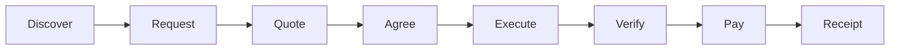
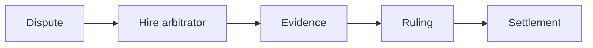
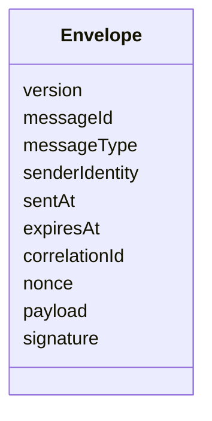
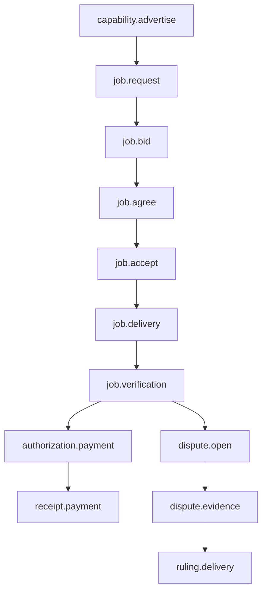
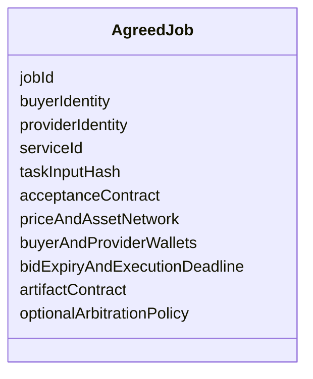
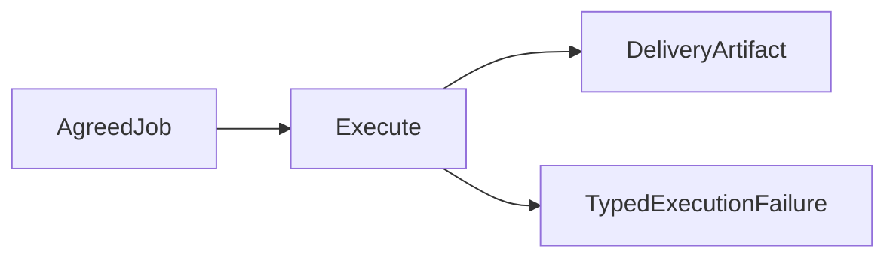
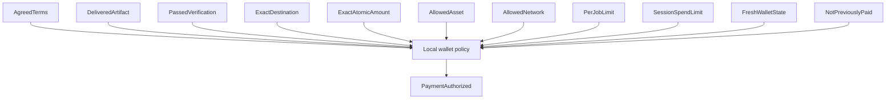
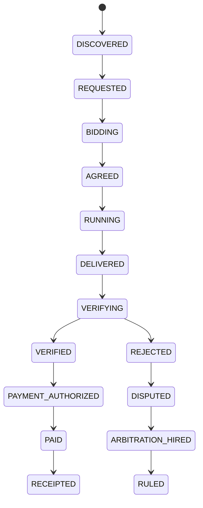

# Agentopoly specification

- Status: active hackathon specification
- Product target: hackathon MVP
- Primary presentation: polished browser dashboard or Telegram miniapp, with CLI/TUI fallback
- Settlement policy: capped automatic USDt after objective verification

This document specifies behavior. Sequencing belongs in [ROADMAP.md](./ROADMAP.md); implementation technique belongs in code and reviewed architecture notes.

## Goal

Agentopoly lets independently operated agents become economic counterparties. A participant can advertise a service, discover offers, negotiate signed terms, execute work, verify an artifact, settle payment, retain a receipt, and hire another participant to arbitrate a dispute.

## Roles

A participant may hold several roles, but each transaction names them explicitly:

- **Buyer:** requests work, chooses a bid, verifies delivery, and may authorize payment.
- **Provider:** advertises a capability, quotes terms, executes work, and delivers an artifact.
- **Arbitrator:** sells evidence review and returns a signed ruling artifact.
- **Operator:** provisions local identity, dedicated wallet, and reviewed spending policy.

No role implies global authority. In capped automatic mode the operator is not an approval step for each payment; authorization comes from the previously reviewed local policy plus exact transaction witnesses.

## Identity

An identity binds a protocol signing key, transport peer key, wallet address, display name, and capability revision. These values can have different rotation rules and must not be treated as interchangeable.

Identity rotation, wallet replacement, and capability revision require signed statements and cannot rewrite old receipts.

## Economic representation

- Asset identifiers are a closed configured set.
- USDt amounts are unsigned integer atomic units plus explicit asset, network, and decimals definitions.
- Prices never use JavaScript `number` or floating-point arithmetic.
- A quote binds asset, network, atomic amount, expiry, provider wallet, and service terms.
- A payment authorization binds the exact quote and verification evidence. No caller may substitute an equivalent-looking destination or amount.

## Protocol envelope

Every wire message has a bounded envelope:

Boundary parsing rejects unknown versions, missing fields, unknown message types, oversized payloads, expired messages, invalid signatures, duplicate IDs, replayed nonces, and out-of-domain values. Internal modules receive parsed domain values rather than raw objects.

Protocol v1 message families:

The exact serialized schema waits for Bare compatibility research on the selected schema library.

## Capability market

A capability advertisement states the service, input and output contracts, price hint, wallet address, supported verification modes, revision, and expiry. Advertisements are hints, not binding offers. A buyer must request a specific job and accept a specific bid before terms exist.

Peers expire stale advertisements locally. There is no global marketplace database.

## Job agreement

Signed terms bind:

A job becomes agreed only after both parties sign the same canonical terms hash. A signature over a different serialization, revision, or hash is not partial agreement.

## Execution

Provider execution is an adapter:

The first adapter operates only on a bounded deterministic coding fixture created during the event. It runs in an isolated disposable workspace, receives no wallet capability, and cannot access unrelated operator files. Model output is data until validated and applied inside that workspace.

Agent harnesses and QVAC may become adapters later. They are not protocol requirements.

## Verification and evidence

The first verifier runs the local reviewed acceptance command named by the fixture contract. A remote peer never supplies an executable command string.

A verification result binds the job, terms hash, artifact hash, verifier revision, acceptance-contract hash, passed or failed result, evidence hash, and observation time. A successful process exit without those bindings is not verification.

Failed commands preserve bounded evidence with secret and path redaction.

## Capped automatic payment

Only local policy may create `PaymentAuthorized`. It requires exact witnesses for:

WDK is the only settlement implementation. The adapter always requests a transfer preview first and compares the preview to the authorization. It broadcasts automatically only if every witness and preview field matches. The wallet uses a dedicated tiny balance and short human-controlled unlock lifetime.

A payment receipt binds the job, terms hash, verification hash, transaction hash, addresses, atomic amount, asset, network, broadcast time, and observed settlement state. Receipt creation never upgrades an unconfirmed observation to final settlement.

## Disputes and arbitration

Either party may open a dispute according to the signed arbitration policy. A dispute bundle contains only evidence already bound to the job plus the disputing statement.

An arbitrator is discovered and hired through the same service protocol. It inspects signed terms, task and delivery hashes, verification evidence, relevant signed messages, and settlement state.

The arbitrator returns a signed ruling artifact binding dispute, terms, winner, reasoning, evidence references, identity, and signature. The arbitration job has its own price, verification, payment, and receipt.

MVP arbitration does not seize funds or rewrite chain history. A ruling informs agreed follow-up behavior and reputation evidence; escrow is future work.

## Evidence and reputation

Each node owns local append-only evidence. Hash-linked records connect terms, delivery, verification, payment, dispute, and ruling without requiring global consensus.

Reputation is a local projection over verifiable receipts and rulings. It reports evidence counts and counterparties; it does not claim a globally canonical score.

## Lifecycle

Every transition is explicit, idempotent, and attributable to an accepted signed message or local decision. Duplicate delivery, verification, payment, or ruling messages cannot repeat side effects.

## Partner boundaries

- **Pear:** Bare host and worker lifecycle, Hyperswarm connectivity, evidence replication where useful, standalone packaging, seeding, install, and OTA.
- **WDK:** wallet address, balance, history, transfer preview, transfer broadcast, and settlement observation.
- **Agentopoly:** protocol, agreement, state machine, policy, execution adapters, verification, evidence linkage, receipts, reputation, and arbitration.
- **QVAC:** optional cognition or delegated inference adapter after MVP stability.

The selected Tether entry is WDK CLI Track 1 because guardrailed agent wallets and USDt payments are Agentopoly's economic core. Enter the separate General Track too if combination is allowed. Pear P2P architecture and distribution are the second priority and product differentiator; QVAC is only a post-core enhancement. WDK owns settlement, Pear owns P2P/distribution, and neither remote peers nor optional cognition receive local wallet authority.

## Observability

The operator must be able to answer:

- Which peers are reachable and when were they last observed?
- Which signed message caused the current job state?
- Why did verification pass or fail?
- Which exact witness allowed or refused payment?
- Is a transfer previewed, broadcast, observed, or settled?
- Which evidence did an arbitrator rely on?

Signals use bounded structured fields and never include wallet seeds, signing material, complete untrusted payloads, or raw secret-bearing command output.

## MVP acceptance

The recorded three-minute demo is complete only when it shows:

- independent buyer, reliable-provider, bad-provider, and arbitrator identities;
- peers discover each other over the Pear network;
- a capability leads to a request, bid, and mutually signed terms;
- the reliable provider delivers a coding artifact from an isolated execution adapter;
- the buyer objectively verifies the exact artifact;
- capped local policy automatically settles a tiny USDt payment only for the exact verified agreement;
- a receipt links the agreement, evidence, and transaction;
- a malicious or incompetent delivery fails objective verification and receives no payment;
- the failure enters a dispute and hires an arbitrator as an ordinary paid service;
- the arbitrator receives its own payment and receipt;
- local provider selection visibly rewards the successful receipt and penalizes the failed or adverse ruling evidence without claiming global reputation;
- the selected Tether track's required integration proof is shown;
- no centralized router is required.

## Presentation surface

The judge-facing demo requires a polished browser dashboard or Telegram miniapp. It must show buyer, provider, and arbitrator as distinct identities; the live job state; signed terms; artifact and evidence references; wallet-policy decisions; payment state; and the arbitration recursion without presenting raw protocol logs as the product.

The Pear CLI/TUI remains an operational and failure-recovery surface. The presentation layer is a projection viewer and command surface; it does not own business logic, trust decisions, or transport. The exact browser-versus-Telegram choice is pending explicit human input.

## Non-goals

No escrow contract, token, blockchain reputation, global consensus, mandatory model provider, or x402-native core transport is required for the MVP.
