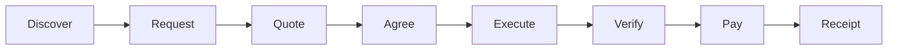
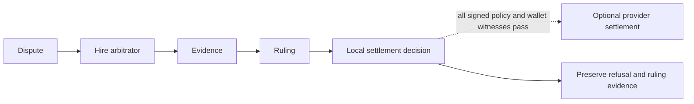
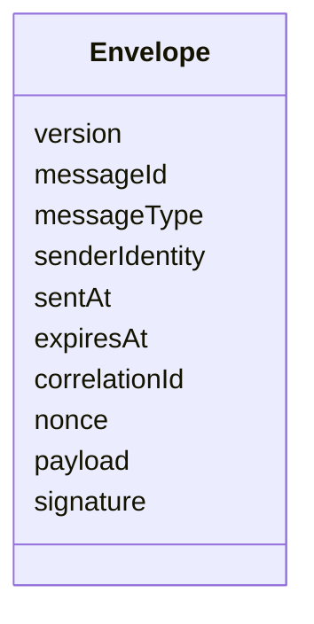
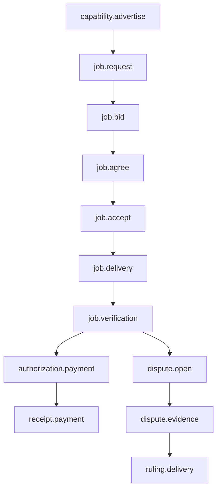
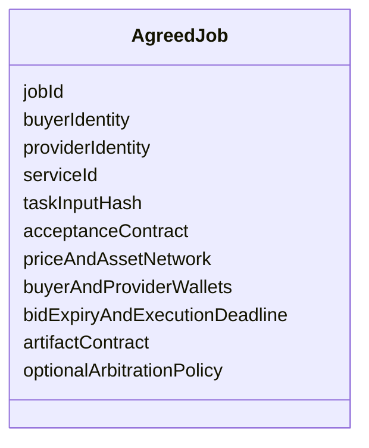
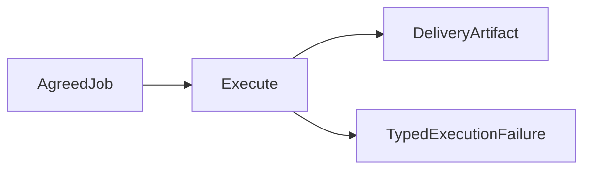
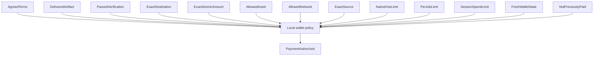
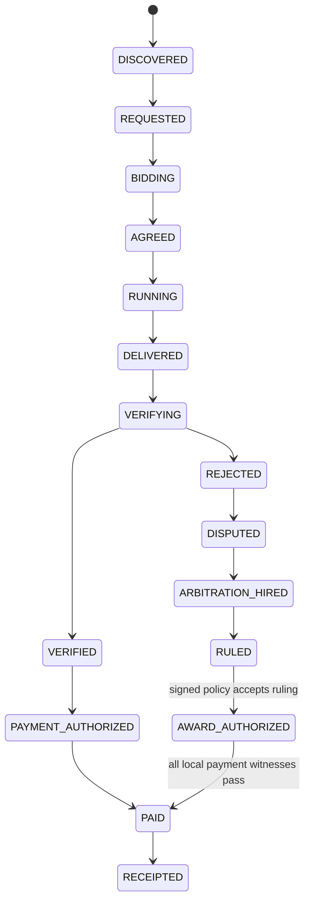

# Agentopoly specification

- Status: active hackathon specification
- Product target: hackathon MVP
- Primary presentation: polished local browser dashboard showing the live agent economy, with CLI/TUI fallback
- Settlement policy: capped automatic USDt after objective verification

This document specifies behavior. Sequencing belongs in [ROADMAP.md](./ROADMAP.md); implementation technique belongs in code and reviewed architecture notes.

## Goal

Agentopoly lets independently operated agents become economic counterparties. A participant can advertise a service, discover offers, negotiate signed terms, execute work, verify an artifact, settle payment, retain a receipt, and hire another participant to arbitrate a dispute.

## Roles

A participant may hold several roles, but each transaction names them explicitly:

- **Buyer:** requests work, chooses a bid, verifies delivery, and agrees to payment terms. A buyer peer message can never authorize or broadcast a local wallet operation; only the reviewed local policy may create `PaymentAuthorized`, and only the local wallet adapter may broadcast it.
- **Provider:** advertises a capability, quotes terms, executes work, and delivers an artifact.
- **Arbitrator:** sells evidence review and returns a signed ruling artifact.
- **Operator:** provisions local identity, dedicated wallet, and reviewed spending policy.

No role implies global authority. In capped automatic mode the operator is not an approval step for each payment; authorization comes from the previously reviewed local policy plus exact transaction witnesses.

## Identity

An identity binds a protocol signing key, transport peer key, wallet address, display name, and capability revision. These values can have different rotation rules and must not be treated as interchangeable.

Identity rotation, wallet replacement, and capability revision require signed statements and cannot rewrite old receipts.

## Economic representation

- Asset identifiers are a closed configured set.
- USDt amounts are unsigned integer atomic units plus explicit asset, network, and decimals definitions.
- Prices never use JavaScript `number` or floating-point arithmetic.
- A quote binds the canonical payment tuple: network identifier, asset identifier and token contract or mint, decimals definition, unsigned atomic amount, source wallet identity and account index, destination address, maximum native-fee atomic amount, expiry, and service terms.
- A payment authorization binds that exact tuple to the terms hash, artifact hash, verification hash, policy revision, and one authorization key. No caller may substitute an equivalent-looking network, asset, source, destination, amount, fee, or evidence record.

## Protocol envelope

Every wire message has a bounded envelope:

Protocol v1 accepts an encoded application frame of at most 65,536 bytes and inline verification evidence of at most 16,384 bytes. Identifiers and identity fields are at most 256 UTF-8 bytes; every other individual string field is at most 1,024 UTF-8 bytes. Compressed frames are not valid in v1. Length and compression markers are checked before payload allocation or decoding. Larger artifacts and evidence use bounded, hash-linked storage references rather than inline frames.

Each participant allows at most 64 connected peers, 32 queued undecoded frames per peer, 128 queued undecoded frames globally, and 20 accepted frames per peer in any rolling 10-second window with a burst ceiling of 40. Ordinary messages expire within five minutes and tolerate at most 30 seconds of future clock skew; capability advertisements expire within fifteen minutes.

Boundary parsing rejects unknown versions, missing fields, unknown message types, oversized payloads, expired messages, invalid signatures, duplicate IDs, replayed nonces, and out-of-domain values. Internal modules receive parsed domain values rather than raw objects.

Protocol v1 message families:

Protocol v1 uses one canonical byte encoding for both signatures and hashes. Issue #3 must prove that the same fixed envelope fixture produces identical bytes in Bun and Bare; object-key order or runtime-specific JSON serialization can never define signed bytes.

Replay admission is strict and durable per `(sender identity, signing-key revision)`. The first accepted nonce establishes a high-water mark. A later nonce is accepted only when it is greater than that mark; gaps are allowed, and a delayed nonce at or below the mark is rejected rather than reordered. A key revision starts a new sequence only after its signed rotation statement is accepted.

The participant atomically persists the new high-water mark, message ID, payload hash, and transition result before acknowledging the message or starting a side effect. Repeating the same message ID and payload returns the recorded result; reusing an ID with different bytes is a conflict. Non-economic deduplication records remain for 30 days after message expiry. Records linked to agreements, execution, verification, payments, receipts, disputes, or rulings remain with that evidence. Networking does not start after restart until replay state decodes and validates; missing or corrupt state fails closed.

## Capability market

A capability advertisement states the service, input and output contracts, price hint, wallet address, supported verification modes, revision, and expiry. Advertisements are hints, not binding offers. A buyer must request a specific job and accept a specific bid before terms exist.

Peers expire stale advertisements locally. There is no global marketplace database.

## Job agreement

Signed terms bind:

A job becomes agreed only after both parties sign the same canonical terms hash. A signature over a different serialization, revision, or hash is not partial agreement.

## Execution

Provider execution is an adapter:

The first adapter operates only on a bounded repository-owned deterministic coding fixture. It runs in an isolated disposable workspace, receives no wallet capability, and cannot access unrelated operator files. Model output is data until validated and applied inside that workspace.

Agent harnesses and QVAC may become adapters later. They are not protocol requirements.

## Verification and evidence

The first verifier runs the local reviewed acceptance command named by the fixture contract. A remote peer never supplies an executable command string.

A verification result binds the job, terms hash, artifact hash, verifier revision, acceptance-contract hash, passed or failed result, evidence hash, and observation time. A successful process exit without those bindings is not verification.

Failed commands preserve bounded evidence with secret and path redaction.

## Capped automatic payment

Only local policy may create `PaymentAuthorized`. It requires exact witnesses for:

WDK is the only settlement implementation. The Track 1 adapter is an operator-local Node sidecar pinned to `@tetherto/wdk-cli` `1.0.0-beta.3`. It launches `wdk-mcp` over stdio and permits only fixed typed calls to `get_address`, `get_balance`, `get_history`, and `send_token`; no model, peer, browser command, or arbitrary MCP client receives that capability. The human creates and unlocks the dedicated tiny-balance wallet, and Agentopoly never handles its passphrase or seed.

For a transfer, the adapter first verifies `get_address` for the authorized wallet and account index, then calls `send_token` with the exact network, registered USDt token, destination, atomic amount string, `baseUnits=true`, and `dryRun=true`. It decodes the response and compares network, token contract, destination, amount, and estimated native fee to `PaymentAuthorized`. The estimate must not exceed the authorized native-fee cap. A local preview expires after 30 seconds; expiry requires a new preview and complete comparison. The adapter broadcasts with the same fixed arguments and `dryRun=false` only while every witness still holds.

Before the broadcast call, durable state atomically changes the authorization key from `available` to `reserved(attemptId, previewHash, expiresAt)`. A duplicate observes that record rather than starting another call. Success records `broadcast(attemptId, transactionHash)` before producing a receipt. A crash or transport failure after reservation leaves `reconciliation-pending`: restart queries WDK history for the exact source, destination, network, token, and amount. It may mark the known transaction broadcast, or release the reservation only when the reviewed reconciliation contract proves no transfer occurred. An unknown result never retries automatically.

A payment receipt binds the job, authorization key, attempt ID, terms hash, verification hash, transaction hash, source and destination, atomic amount, asset and token contract, network, estimated and observed native fee, policy revision, broadcast time, and observed settlement state. Receipt creation never upgrades an unconfirmed observation to final settlement.

## Disputes and arbitration

Either party may open a dispute according to the signed arbitration policy. When verification fails, the buyer withholds the original provider payment before opening the dispute. A dispute bundle contains only evidence already bound to the job plus the disputing statement.

An arbitrator is discovered and hired through the same service protocol. It inspects signed terms, task and delivery hashes, verification evidence, relevant signed messages, and settlement state. The arbitration job is a separate agreement with its own price, verification, payment, and receipt; paying the arbitrator never pays the original provider.

The arbitrator returns a signed ruling artifact binding dispute, terms, winner, reasoning, evidence references, identity, and signature. A provider-favorable ruling may authorize a follow-up settlement only when the original signed arbitration policy defines that ruling as an accepted witness and every local destination, asset, network, amount, limit, preview, and idempotency check passes. Otherwise the original provider remains unpaid.

MVP arbitration does not seize or reserve funds and cannot rewrite chain history. Escrow would reduce provider-side non-payment risk and make awards more enforceable, but it adds custody and contract risk and is future work.

## Evidence and reputation

Each node owns local append-only evidence. Hash-linked records connect terms, delivery, verification, payment, dispute, and ruling without requiring global consensus.

Reputation is a local projection over verifiable receipts and rulings. It reports evidence counts and counterparties; it does not claim a globally canonical score.

## Lifecycle

Every transition is explicit, idempotent, and attributable to an accepted signed message or local decision. A ruling never implies payment authorization by itself. Duplicate delivery, verification, payment, or ruling messages return their recorded result without repeating side effects. Payment retries follow the durable reservation and reconciliation contract, including a crash after broadcast but before receipt persistence.

## Partner boundaries

- **Pear:** Bare host and worker lifecycle, Hyperswarm connectivity, evidence replication where useful, standalone packaging, seeding, install, and OTA.
- **WDK:** the pinned operator-local `wdk-mcp` sidecar and wallet daemon own address, balance, history, preview, broadcast, and settlement observation; the Pear worker has no wallet capability.
- **Agentopoly:** protocol, agreement, state machine, policy, execution adapters, verification, evidence linkage, receipts, reputation, and arbitration.
- **QVAC:** optional cognition or delegated inference adapter after MVP stability.

The submission enters WDK CLI Track 1 as its single Tether track and also enters the separate General Track; it never enters multiple Tether tracks. Guardrailed agent wallets and USDt payments are Agentopoly's economic core, while Pear P2P architecture and distribution make the independent marketplace possible. QVAC is only a post-core enhancement. WDK owns settlement, Pear owns P2P/distribution, and neither remote peers nor optional cognition receive local wallet authority.

## Observability

The operator must be able to answer:

- Which peers are reachable and when were they last observed?
- Which signed message caused the current job state?
- Why did verification pass or fail?
- Which exact witness allowed or refused payment?
- Is a transfer previewed, broadcast, observed, or settled?
- Which evidence did an arbitrator rely on?

Signals use bounded structured fields and never include wallet seeds, signing material, complete untrusted payloads, or raw secret-bearing command output.

## MVP acceptance

The recorded three-minute demo is complete only when it shows:

- independent buyer, reliable-provider, bad-provider, and arbitrator identities;
- peers discover each other over the Pear network;
- a capability leads to a request, bid, and mutually signed terms;
- the reliable provider delivers a coding artifact from an isolated execution adapter;
- the buyer objectively verifies the exact artifact;
- capped local policy automatically settles a tiny USDt payment only for the exact verified agreement;
- a receipt links the agreement, evidence, and transaction;
- a malicious or incompetent delivery fails objective verification and receives no payment;
- the failure enters a dispute and hires an arbitrator as an ordinary paid service;
- the arbitrator receives its own payment and receipt;
- local provider selection visibly rewards the successful receipt and penalizes the failed or adverse ruling evidence without claiming global reputation;
- the selected Tether track's required integration proof is shown;
- no centralized router is required.

Hostile and stale inputs have explicit acceptance outcomes:

| Input                                                                | Observable outcome                                              | Side-effect guarantee                                            |
| -------------------------------------------------------------------- | --------------------------------------------------------------- | ---------------------------------------------------------------- |
| Malformed or oversized frame                                         | Bounded boundary refusal; job state unchanged                   | No execution, signing, WDK, or settlement call                   |
| Replayed nonce, duplicate ID, or expired message                     | Recorded replay, duplicate, or expiry result; no new transition | Previously recorded result only; no repeated side effect         |
| Impossible state transition                                          | Typed invariant refusal; prior valid state retained             | No partial durable mutation or external side effect              |
| Unauthorized payment request                                         | Refusal identifies the failed local witness                     | Zero WDK preview or broadcast calls                              |
| Source, token, amount, destination, network, or fee-preview mismatch | Payment remains refused or reserved for a fresh exact preview   | Zero WDK broadcast calls                                         |
| Unknown result after reservation                                     | Visible `reconciliation-pending` state                          | No automatic retry until reconciliation proves no prior transfer |

## Presentation surface

The judge-facing demo uses a polished local browser dashboard. Its primary view is a live registry of agents and jobs that makes capability advertisements, negotiations, verification, payments, receipts, and disputes visible as a real-time marketplace and agent economy. It must show buyer, provider, and arbitrator as distinct identities; signed terms; artifact and evidence references; wallet-policy decisions; payment state; and arbitration recursion without presenting raw protocol logs as the product.

The dashboard may expose a narrow typed command surface for a human to communicate with their own local agent. The Pear CLI/TUI remains an operational and failure-recovery surface. Every presentation surface reads projections and submits typed local commands; none owns business logic, trust decisions, transport, or wallet authority.

## Non-goals

No escrow contract, token, blockchain reputation, global consensus, mandatory model provider, or x402-native core transport is required for the MVP.
