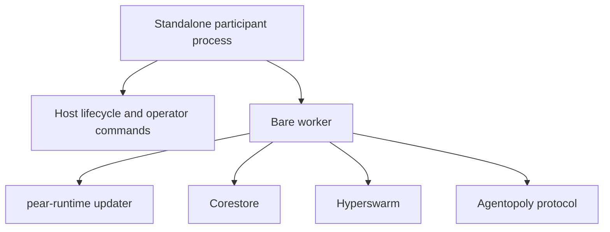
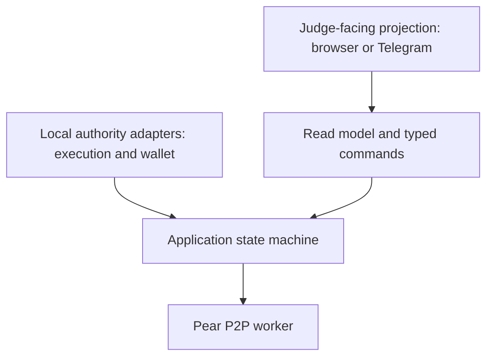
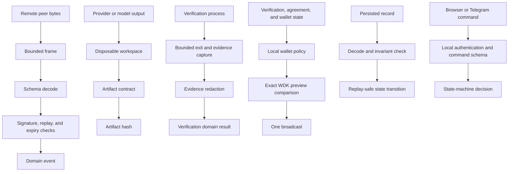
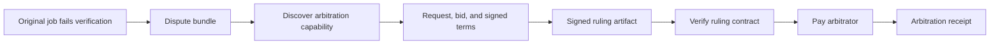

# Architecture

- Status: active hackathon design

## Architectural objective

The system makes independent agency visible. Buyer, provider, and arbitrator own separate identities, policies, evidence, and wallet boundaries even when several participants run on one machine.

## Runtime shape

Current Pear documentation describes a standalone participant with a host and a Bare worker:

Agentopoly adds two local boundaries without making them peer-authoritative:

The presentation layer renders projections and submits typed local commands. It never decides whether terms are valid, verification passed, or payment is authorized.

## Component ownership

### Participant host

Owns process lifecycle, local identity selection, role selection, graceful shutdown, projection API, and operator-visible status. It does not parse arbitrary peer payloads or hold wallet secrets.

### Pear worker

Owns embedded Pear OTA, Hyperswarm connections, bounded framing, protocol message exchange, capability advertisement, and evidence replication. It returns parsed events or typed boundary failures to the state machine.

### Protocol domain

Owns canonical serialization, message identity, signature verification, domain parsing, terms hashes, artifact hashes, state transitions, idempotency, dispute linkage, and receipt linkage. It has no network, filesystem, wallet, model, or UI capability.

### Capability market

Maintains a local view of live advertisements and counterparty observations. It has no global truth and may differ across nodes.

### Execution adapter

Runs provider work in a disposable bounded workspace. The first adapter knows only the deterministic coding fixture. It cannot call WDK or inspect unrelated host files.

### Verification adapter

Maps an agreed acceptance contract to one reviewed local command and hashes the bounded evidence. A peer-supplied string never becomes executable control flow.

### Wallet policy

Consumes parsed agreement and verification facts plus reviewed limits. It produces either a typed refusal or `PaymentAuthorized`. It has no P2P socket and never accepts a remote tool call directly.

### WDK adapter

Reads the dedicated wallet, previews a transfer, compares preview fields to `PaymentAuthorized`, broadcasts once, and observes transaction history/state. Wallet administration remains human-owned.

### Evidence store

Appends signed, hash-linked records. Corestore is the likely persistence substrate, but storage semantics remain behind an interface until at-rest and replication requirements are verified.

### Projection layer

Derives peer, market, job, evidence, payment, reputation, and arbitration views. The browser or Telegram surface reads only these projections and sends typed commands back through a local API.

## Trust boundaries

Nothing crossing one boundary is trusted merely because an earlier boundary accepted a related value.

## State and consistency

Each node has authoritative local state only for its own decisions and evidence. Signed counterparty statements can be verified but not rewritten. Job transitions are deterministic, explicit, and idempotent.

The protocol requires correlation IDs and monotonic per-identity nonces, but does not require a total global order. Conflicting signed statements become evidence for refusal or dispute rather than a consensus problem.

## Recursive arbitration

Arbitration reuses the normal service path:

The original dispute and the arbitration job have different job IDs and receipts. Their evidence links are explicit.

## Presentation architecture

Presentation quality is a product requirement. The final judge experience is not terminal-only.

Preferred current shape:

- a local browser dashboard served from the buyer participant;
- three visually distinct role lanes;
- one economic timeline from discovery to receipt;
- evidence and policy details available on demand;
- an arbitration view that visibly creates a second paid job;
- CLI/TUI fallback for operational recovery.

A Telegram miniapp remains a viable alternative or secondary surface. Neither surface may become the P2P transport or trust authority.

## Unresolved integration constraints

1. Whether Effect and the chosen schema library are fully Bare-compatible.
2. Whether WDK should be called through its CLI/MCP daemon, an SDK module, or a narrow sidecar.
3. Whether the local browser projection server can live in the Bare host without Node compatibility.
4. How TypeScript compiles and bundles into the standalone Bare executable.
5. Which signature and canonical-serialization primitives have the smallest compatible dependency surface.

These constraints are research issues, not reasons to generalize the architecture before the first transaction.
