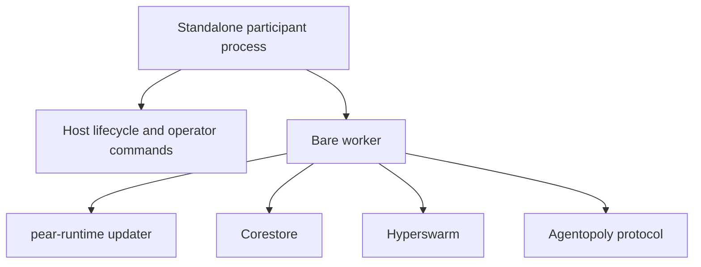
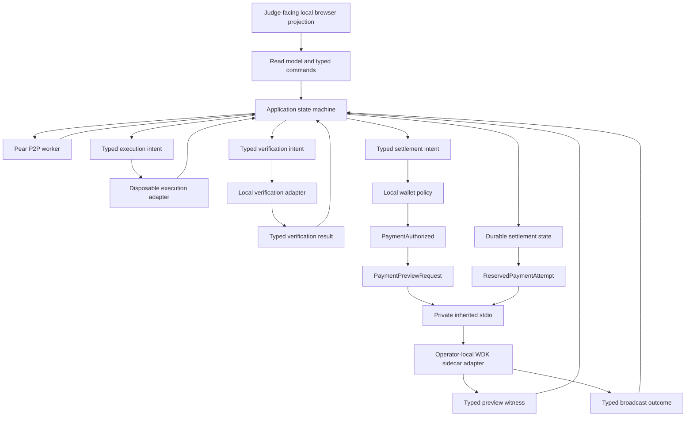
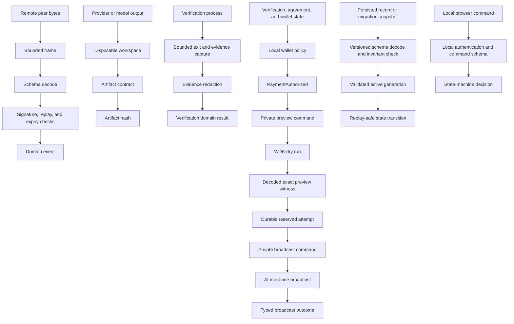
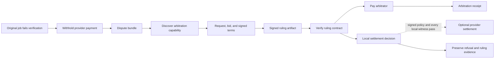

# Architecture

- Status: active hackathon design

## Architectural objective

The system makes independent agency visible. Buyer, provider, and arbitrator own separate identities, policies, evidence, and wallet boundaries even when several participants run on one machine.

## Runtime shape

Current Pear documentation describes a standalone participant with a host and a Bare worker:

Agentopoly adds explicit local authority boundaries without making them peer-authoritative:

The presentation layer renders projections and submits typed local commands. It never decides whether terms are valid, verification passed, or payment is authorized. The P2P worker can produce domain events but cannot reach execution or wallet capabilities directly.

## Component ownership

### Participant host

Owns process lifecycle, local identity selection, role selection, graceful shutdown, projection API, and operator-visible status. It does not parse arbitrary peer payloads or hold wallet secrets.

### Pear worker

Owns embedded Pear OTA, Hyperswarm connections, bounded framing, protocol message exchange, capability advertisement, and evidence replication. It returns parsed events or typed boundary failures to the state machine.

### Protocol domain

Owns canonical serialization, message identity, signature verification, domain parsing, terms hashes, artifact hashes, state transitions, idempotency, dispute linkage, and receipt linkage. It has no network, filesystem, wallet, model, or UI capability.

### Capability market

Maintains a local view of live advertisements and counterparty observations. It has no global truth and may differ across nodes.

### Execution adapter

Runs provider work in a disposable bounded workspace. The first adapter knows only the deterministic coding fixture. It cannot call WDK or inspect unrelated host files.

### Verification adapter

Maps an agreed acceptance contract to one reviewed local command and hashes the bounded evidence. `VerificationIntent` binds the job ID, terms hash, artifact hash, acceptance-contract hash, and verifier revision. `VerificationResult` returns those same bindings plus passed or failed status, evidence hash, and observation time. The state machine rejects any mismatch rather than accepting a standalone passed result. A peer-supplied string never becomes executable control flow.

### Wallet policy

Consumes parsed agreement and verification facts plus reviewed limits. It produces either a typed refusal or `PaymentAuthorized`. It has no P2P socket and never accepts a remote tool call directly.

### Planned WDK settlement sidecar

The selected contract requires a Node.js 22.18-or-newer child process reached only through private inherited stdio. The inherited pipe endpoint is the caller capability, and the sidecar accepts one parent channel while exposing no listening endpoint or arbitrary MCP relay. A closed boundary command union permits fixed address, balance, history, preview, and reserved-attempt messages. `PaymentPreviewRequest` binds `PaymentAuthorized` and can request only a dry run. A broadcast requires `ReservedPaymentAttempt`, which binds that authorization to the durable authorization key, attempt ID, preview hash, and preview expiry; raw transfer arguments are invalid.

The sidecar would launch the pinned `@tetherto/wdk-cli` `1.0.0-beta.3` MCP server over its own stdio and map the closed commands to fixed typed calls. The human owns wallet creation and unlock. The MCP server would reach the WDK daemon through its user-scoped Unix socket; the Pear worker receives neither socket access nor wallet capability. A compromised same-user process may still reach the WDK daemon independently. No merged sidecar implementation or wallet-readiness claim exists yet.

For settlement, the sidecar contract requires source verification, a base-unit dry-run preview, exact authorized-tuple and native-fee comparison, atomic authorization reservation, a durable `broadcasting` marker, and at most one external broadcast. The exact WDK response fields remain an open captured-response proof; absent or synthesized preview fields fail closed. Only a fully decoded success response with a transaction hash from that in-flight call can identify the attempt. Every other post-invocation result is unknown and stays reserved. History tuple matches are candidates only and cannot create attempt identity or release the reservation.

### Evidence store

Appends signed, hash-linked records. Every persisted record and migration snapshot is schema-versioned, decoded, and invariant-checked before use. Corestore is the likely persistence substrate, but storage semantics remain behind an interface until issue #3 proves immutable generations, checksums, a durable active-generation manifest, single-writer fencing, and crash recovery; issue #13 owns the malformed, stale-writer, interruption, and preservation tests.

### Projection layer

Derives peer, market, job, evidence, payment, reputation, and arbitration views. The local browser dashboard reads only these projections and sends typed commands back through a bounded local API.

## Trust boundaries

Nothing crossing one boundary is trusted merely because an earlier boundary accepted a related value.

## State and consistency

Each node has authoritative local state only for its own decisions and evidence. Signed counterparty statements can be verified but not rewritten. Job transitions are deterministic, explicit, and idempotent.

Protocol v1 keeps a durable nonce high-water mark for each `(sender identity, signing-key revision)`. It accepts only a nonce greater than the mark: gaps are allowed, while delayed or replayed lower values are rejected rather than reordered. After bounded schema and signature checks, an existing message ID is resolved before expiry and nonce checks, preserving distinct duplicate, conflict, expiry, and replay outcomes. Message ID, payload hash, result, and the new mark are persisted atomically before acknowledgement or side effects. A signed key revision starts an independent sequence.

Every persisted record is schema-versioned and decoded before use. Migration writes an immutable replacement generation, validates its invariants and checksum, and atomically selects it through a durable generation manifest. Single-writer fencing rejects stale commits. A crash leaves either the complete old or complete new generation authoritative; unsupported, corrupt, or unselected state keeps networking closed. The protocol requires no total global order; conflicting signed statements become evidence for refusal or dispute rather than a consensus problem.

## Recursive arbitration

Arbitration reuses the normal service path:

The original dispute and the arbitration job have different job IDs, payment authorizations, and receipts. Their evidence links are explicit. The original provider remains unpaid while the dispute is open. Paying the arbitrator cannot settle the original job, and a ruling cannot authorize any transfer unless the original signed policy and every local wallet witness permit it.

## Presentation architecture

Presentation quality is a product requirement. The final judge experience is not terminal-only.

Selected shape:

- a local browser dashboard served from the buyer participant;
- a live registry of agents, capabilities, availability, and jobs;
- real-time marketplace and economic state transitions;
- visually distinct buyer, provider, and arbitrator identities;
- one economic timeline from discovery to receipt;
- evidence and policy details available on demand;
- an arbitration view that visibly creates a second paid job;
- an optional narrow typed command surface for communication with the human's own local agent;
- CLI/TUI fallback for operational recovery.

The dashboard is a projection and local command surface. It never becomes the P2P transport, trust authority, or wallet authority.

## Open implementation proofs

1. Prove Bare import and bundle compatibility for the reviewed schema decoder used at every untrusted wire and persisted-state boundary; decoder selection is open, but decoding is mandatory.
2. Prove the pinned `wdk-mcp` stdio request and response contract against captured official-package responses, including preview fields, transaction hashes, error shapes, and private parent-child command authentication, before implementing settlement policy.
3. Prove whether the local browser projection server belongs in the Bare host or a separate wallet-blind host process.
4. Select and test a bounded loopback transport for typed dashboard commands without expanding browser authority.
5. Compile and package TypeScript into the standalone Bare executable on each target platform.
6. Produce identical canonical bytes and signature fixtures in Bun and Bare.

These are tracked compatibility proofs, not product questions or reasons to generalize the architecture before the first transaction.
