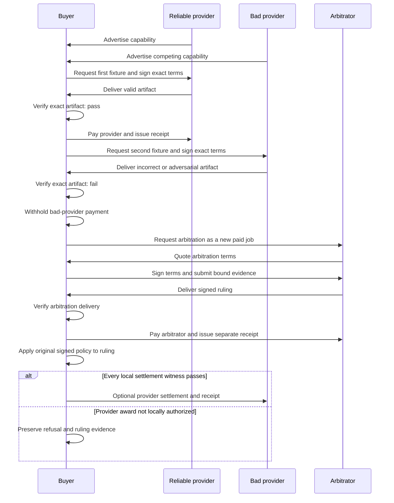

# Three-minute demo contract

Initial judging is async and entirely online. The required artifact is a three-minute recorded video, not a fragile live multi-device performance. Live topology becomes relevant only if the project reaches finals.

This document defines target acceptance, not current implementation evidence. The WDK sidecar, preview, broadcast, and wallet capability remain unimplemented and must not appear in a recording until the pinned boundary and real responses pass their required tests.

## Required story: the market distinguishes good work from bad

1. Four distinct identities appear: buyer, reliable provider, malicious or incompetent provider, and arbitrator.
2. Buyer discovers both providers' coding capabilities over the Pear network.
3. Buyer sees price plus evidence-backed local history, not a magical global score.
4. Buyer requests a bounded fixture task and signs exact terms with the reliable provider.
5. The reliable provider delivers a patch that passes objective verification.
6. Capped local policy explains every witness, previews the WDK transfer, and broadcasts automatically.
7. A linked receipt strengthens the reliable provider's local reputation.
8. The bad provider returns an incorrect or adversarial artifact for a second bounded fixture.
9. Verification fails, no payment authorization is produced, and the failure becomes signed evidence.
10. A dispute hires the arbitrator through the same request, quote, and agreement path.
11. The arbitrator examines the bound evidence, issues a signed ruling, and receives a separate payment and receipt.
12. The market view now favors the reliable provider using transparent receipt and ruling evidence while the bad outcome remains visible.
13. The close proves the selected Tether track's required integration.

The story demonstrates an economy rather than merely a transfer: good agents gain payment, evidence, and repeat-business probability; incompetent or malicious agents lose payment and future selection probability.

## Presentation requirements

Terminal-only is not enough. The primary judge surface is a polished local browser dashboard. Its central view is a live registry of agents and jobs that makes marketplace activity and the agent economy observable in real time. A narrow typed command surface may let a human communicate with their own local agent; it never grants the dashboard wallet, transport, or trust authority. The CLI/TUI remains the fallback.

The dashboard must make these facts legible without reading raw JSON:

- peers are independent identities;
- agents advertise capabilities and availability in a live registry;
- jobs and economic state transitions update in real time;
- discovery happened over P2P transport;
- price and terms were negotiated rather than hardcoded invisibly;
- verification controls payment;
- wallet policy is local and capped;
- receipts link economic facts;
- arbitration is itself another paid job.

Recommended visual model:

Raw protocol messages, full process output, wallet details, and secret-bearing diagnostics stay behind bounded debug tooling and are never the default presentation.

## Recording contract

The recording must show the actual running product. Editing may compress waiting but must not splice mocked output into a claimed external effect.

Capture uncut backup clips for external and distribution evidence:

- clean Pear install and OTA propagation;
- WDK preview, broadcast, and transaction observation;
- multi-process or multi-device peer discovery;
- QVAC model load and repeated trials if that track is selected.

If an external network is degraded during final editing, use earlier uncut evidence and label it accurately. Prepare a separate live topology only if the project reaches finals.

## Failure handling

The UI must turn a failure into useful evidence:

- peer unavailable -> bounded timeout and retry state;
- verifier fails -> preserved redacted evidence and dispute affordance;
- wallet policy refuses -> exact failed witness, no broadcast;
- chain observation delayed -> broadcast but not settled;
- arbitrator unavailable -> dispute remains open without corrupting the original job;
- OTA unavailable -> installed binary remains usable.

## Three-minute cut

- **0:00-0:20:** problem and four-party market;
- **0:20-0:50:** P2P discovery and competing capability advertisements;
- **0:50-1:30:** reliable provider, objective pass, capped automatic USDt payment, and receipt;
- **1:30-2:20:** bad delivery, zero payment, dispute, paid ruling, and arbitration receipt;
- **2:20-2:45:** evidence-backed local reputation changes provider selection;
- **2:45-3:00:** selected sponsor proof and close.

## Submission evidence checklist

- three-minute video with English captions where required;
- architecture diagram;
- uncut sponsor-integration evidence;
- repository history containing only hackathon work;
- README with exact clean-clone instructions;
- direct sponsor integration permalinks;
- disclosed limitations: no escrow, local—not global—reputation, provider non-payment risk, and optional QVAC/x402.
